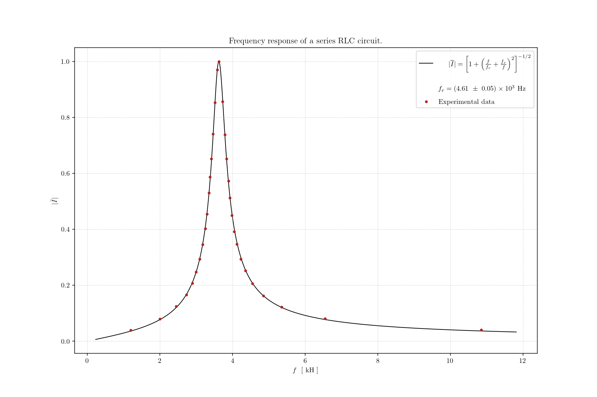
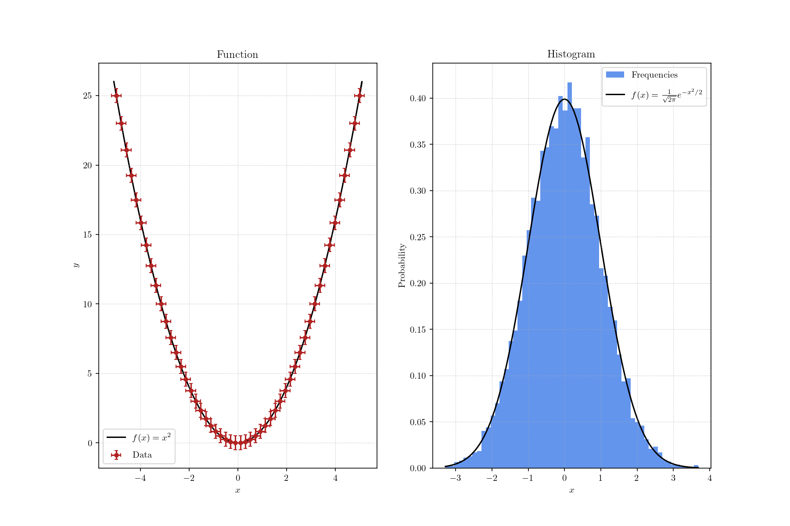

# Plotter

A small Python library for drawing beautiful plots on top of `matplotlib`.

## Description

_Plotter_ wraps common plotting tasks in small drawable objects with sensible defaults.
The library is still `matplotlib`-based, so it works best when the user is already somewhat
familiar with the underlying plotting model.

The current design revolves around:

- a `Canvas` object, which owns the figure and axes and acts as a context manager;
- drawable objects such as `ScatterPlot`, `LinePlot`, `Hist`, `Hist2D`, and `Image`;
- optional JSON text files used to populate titles, axis labels, and legend labels.

## Installation

On Unix-like systems:

1. Clone the repository.
2. Move into the project directory.
3. Install the package:

   ```bash
   pip install .
   ```

4. Import it in Python:

   ```python
   import plotter
   ```

## Workspace Layout

Call `plotter.setup_workspace()` once in the directory where you want to work.
This creates the files and folders used by the library:

```text
plotter
├── img
├── log
│   └── plotter.log
├── text
│   └── text_example.json
└── utils
    ├── blueprint.txt
    ├── info
    ├── log_config.json
    └── style.mplstyle
```

These files have the following purposes:

1. `plotter/img/` stores saved figures.
2. `plotter/log/` stores log output.
3. `plotter/text/` stores JSON files with plot titles, axis labels, and legend labels.
4. `plotter/utils/` stores bundled helper assets and configuration files.

## Usage

`Canvas` is a context manager. That means the figure lifecycle is handled automatically:
when the `with` block exits, Plotter finalizes the legend, saves the figure if requested, and
shows or closes it depending on the canvas configuration.

### Example

```python
import numpy as np
import plotter as p


def f(x):
    return x**2


# datasets to plot
x = np.linspace(-5, 5, num=50)
y = x**2
y_err = np.full(50, 0.5)
x_err = np.full(50, 0.2)


with p.Canvas("example.json", show=False) as canvas:
    canvas.setup()

    p.ScatterPlot(x, y, y_err, x_err).draw(canvas, label="data")
    p.LinePlot(x, f, wider=(0.01, 0.01)).draw(canvas, label=r"$f(x)=x^2$")
```

### Available Drawables

- `ScatterPlot`: scatter plots with optional x/y error bars.
- `LinePlot`: function plots or explicit x/y line plots.
- `Hist`: one-dimensional histograms.
- `Hist2D`: two-dimensional histograms with colorbars.
- `Image`: grayscale or RGB(A) image rendering.

All drawable classes inherit from `Drawable` and implement a `draw(canvas, ...)` method.

## Images




## License

See the [LICENSE](LICENSE) file for license rights and limitations.
