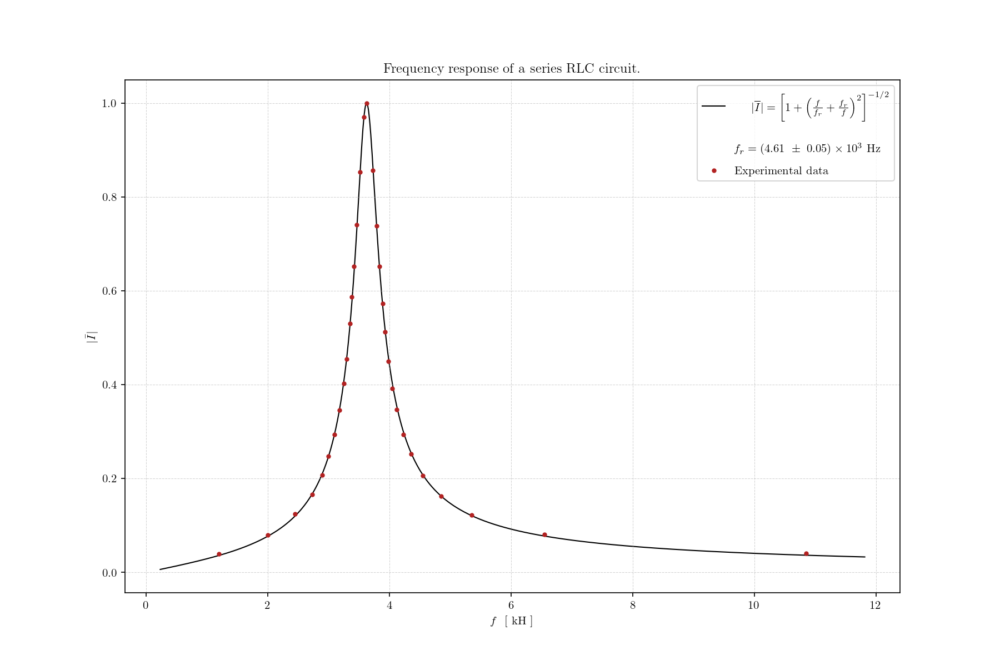

# Plotter Documentation

Plotter is a small Python library for drawing beautiful plots on top of Matplotlib.
This site turns the package docstrings into a browsable reference, so users can
quickly discover the canvas lifecycle, drawable objects, text-file conventions,
and helper functions.



## Start Here

The library is centered on a `Canvas` context manager. Create one canvas, configure
its subplots, draw one or more drawable objects, and let the context manager save,
show, or close the Matplotlib figure.

```python
import numpy as np
import plotter as p

x = np.linspace(-5, 5, num=50)
y = x**2

with p.Canvas("example.json", rows_cols=(1, 1), show=False) as canvas:
    canvas.setup(0)
    p.ScatterPlot(x, y).draw(canvas, label="data")
    p.LinePlot(x, lambda values: values**2).draw(canvas, label="model")
```

## What To Read

- [Quickstart](quickstart.md): setup, workspace layout, and the main plotting flow.
- [API Reference](api/index.md): every module, class, method, and function with a docstring.
- [Canvas](api/canvas.md): figure lifecycle, subplot setup, legends, ticks, guide lines, and scale bars.
- [Drawables](api/scatter.md): scatter plots, line plots, bar charts, histograms, and images.
