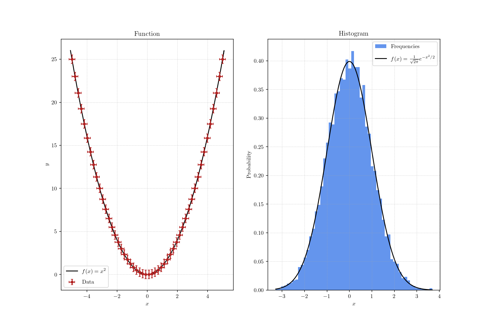

# Quickstart

## Install

From the project root:

```bash
pip install .
```

## Create A Workspace

Call `plotter.setup_workspace()` in the directory where you want Plotter to place
runtime assets. It creates folders for generated images, logs, text files, and
bundled helper resources.

```python
import plotter as p

p.setup_workspace()
```

## Add Plot Text

Canvas text comes from JSON files in `plotter/text`. Each subplot entry can define
axis labels, a title, and drawable labels:

```json
[
  {
    "title": "Example",
    "x_label": "x",
    "y_label": "y",
    "scatter_plots": ["data"],
    "line_plots": ["model"],
    "bar_charts": [""],
    "histograms": [""],
    "histograms_2d": [""],
    "images": [""]
  }
]
```

## Draw

```python
import numpy as np
import plotter as p

x = np.linspace(0, 10, 100)

with p.Canvas("example.json", show=False, save="example.png") as canvas:
    canvas.setup(xlim=(0, 10), ylim=(-1.2, 1.2))
    p.LinePlot(x, np.sin).draw(canvas, color="darkgreen", label="sin(x)")
    canvas.draw_line("h", point=0, style="--")
```


